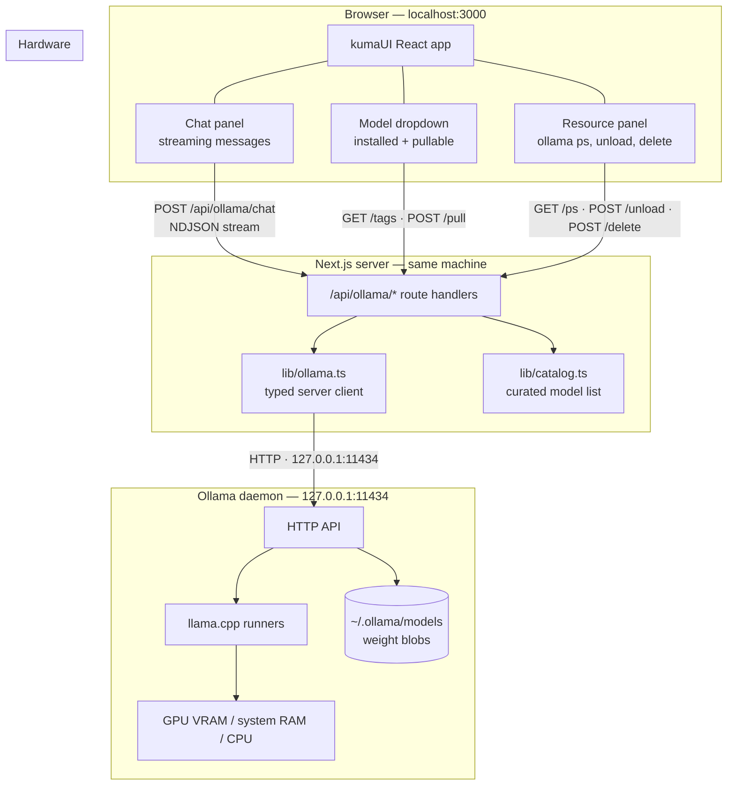
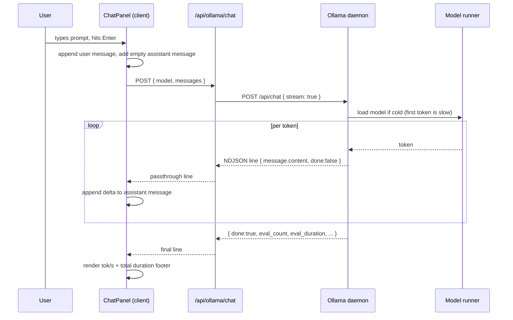
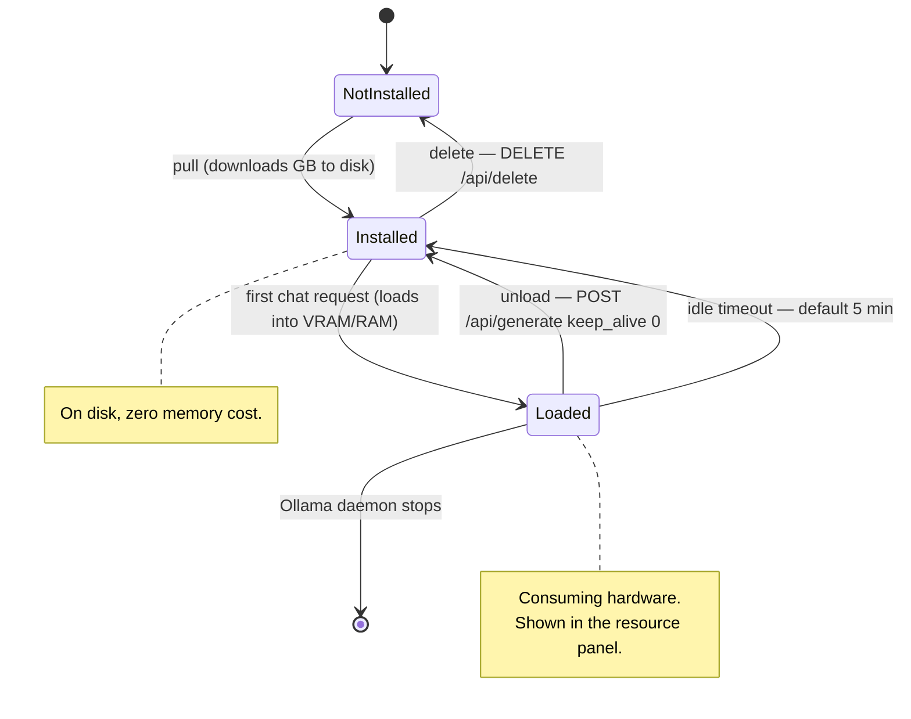
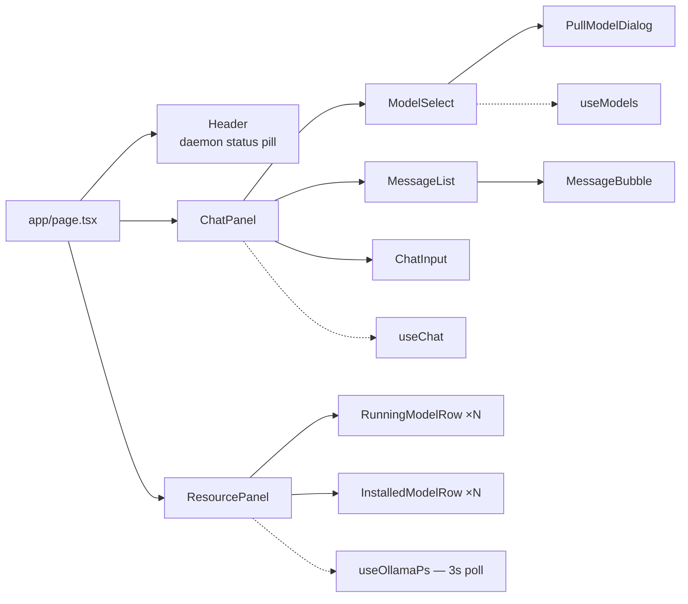
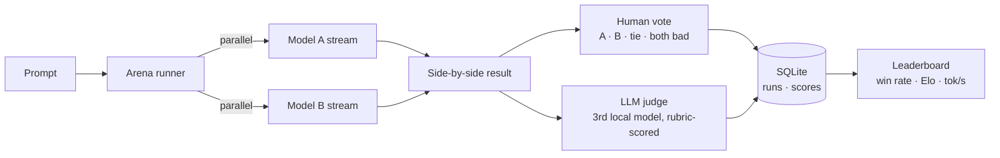

# kumaUI — Project Specification

**Version:** 1.0 (V1 shipped, V2+ planned)
**Owner:** nick
**Last updated:** 2026-08-18

---

## 1. Overview

kumaUI is a local-first web interface for open-source large language models served by
[Ollama](https://ollama.com). It runs entirely on the user's machine: the browser talks to a
Next.js server on `localhost:3000`, which proxies to the Ollama daemon on `127.0.0.1:11434`.
No model weights, prompts, or responses leave the machine.

### Goals

| # | Goal |
|---|------|
| G1 | Chat with any locally-installed open-source model through a clean streaming UI |
| G2 | Discover and pull new open-source models from inside the app, with live download progress |
| G3 | See exactly what hardware the loaded models are consuming (the `ollama ps` view) |
| G4 | Reclaim resources on demand — unload a model from memory, or delete it from disk |
| G5 | *(V2)* Run one prompt against two models and score which output is better |

### Non-goals

- Hosted/cloud model providers (OpenAI, Anthropic, Bedrock). Local only.
- Multi-user accounts, auth, or deployment to a server.
- Fine-tuning, training, or LoRA management.
- Mobile-first layout. Desktop browser is the target.

---

## 2. Architecture

### 2.1 System diagram



### 2.2 Request flow — streaming chat



### 2.3 Resource lifecycle



### 2.4 Component tree



---

## 3. API surface

All handlers live under `src/app/api/ollama/`. All are `runtime = "nodejs"`,
`dynamic = "force-dynamic"`.

| Route | Method | Upstream Ollama call | Response | Notes |
|---|---|---|---|---|
| `/api/ollama/version` | GET | `GET /api/version` | `{ ok, version }` | Health probe. `ok:false` when daemon is down. |
| `/api/ollama/tags` | GET | `GET /api/tags` | `{ models: InstalledModel[] }` | Installed models, sorted by name. |
| `/api/ollama/ps` | GET | `GET /api/ps` | `{ models: RunningModel[] }` | Adds derived `sizeCpu`, `vramPercent`, `expiresInSec`. |
| `/api/ollama/pull` | POST | `POST /api/pull` | NDJSON stream | Body `{ model }`. Streams `{ status, completed, total }`. |
| `/api/ollama/chat` | POST | `POST /api/chat` | NDJSON stream | Body `{ model, messages, options? }`. Abortable. |
| `/api/ollama/unload` | POST | `POST /api/generate` `keep_alive:0` | `{ ok }` | Frees memory, keeps weights on disk. |
| `/api/ollama/delete` | POST | `DELETE /api/delete` | `{ ok }` | Destructive. UI confirms first. |

### 3.1 Core types

```ts
type ChatMessage = { role: "system" | "user" | "assistant"; content: string };

type InstalledModel = {
  name: string;            // "llama3.2:3b"
  digest: string;
  size: number;            // bytes on disk
  modifiedAt: string;      // ISO
  family: string;          // "llama"
  parameterSize: string;   // "3.2B"
  quantization: string;    // "Q4_K_M"
};

type RunningModel = InstalledModel & {
  sizeTotal: number;       // bytes resident
  sizeVram: number;        // bytes on GPU
  sizeCpu: number;         // sizeTotal - sizeVram
  vramPercent: number;     // 0-100
  expiresAt: string;       // ISO, auto-eviction time
  expiresInSec: number;
};

type ChatStats = {
  totalDurationMs: number;
  loadDurationMs: number;
  promptTokens: number;
  evalTokens: number;
  tokensPerSecond: number;
};
```

### 3.2 Streaming contract

Both `/chat` and `/pull` emit newline-delimited JSON, passed through unmodified from Ollama plus
one optional trailing `{"error": "..."}` line if the upstream dies mid-stream. Clients read with
`response.body.getReader()`, split on `\n`, and keep a partial-line buffer across chunks.

---

## 4. V1 — Chat + resource management (shipped)

### 4.1 Screen layout

```
┌───────────────────────────────────────────────────────────────────────────┐
│  kumaUI                                    ● ollama 0.x.x connected       │
├──────────────────────────────────────────┬────────────────────────────────┤
│  ┌────────────────────────────────────┐  │  RESOURCES                     │
│  │ Model: [ llama3.2:3b        ▾ ]    │  │  ┌──────────────────────────┐  │
│  │        ...installed models          │  │  │ llama3.2:3b              │  │
│  │        ─────────────────────        │  │  │ 3.4 GB · 100% GPU        │  │
│  │        + Pull a new model...        │  │  │ evicts in 4m 12s         │  │
│  └────────────────────────────────────┘  │  │ [Unload]                 │  │
│                                           │  └──────────────────────────┘  │
│   ┌── user ─────────────────────────┐    │  Total resident: 3.4 GB        │
│   │ explain KV cache in one para    │    │                                │
│   └─────────────────────────────────┘    │  INSTALLED (5)                 │
│   ┌── assistant ────────────────────┐    │  llama3.2:3b   2.0 GB [Delete] │
│   │ The KV cache stores...▊         │    │  qwen2.5:7b    4.7 GB [Delete] │
│   └─────────────────────────────────┘    │  phi4:14b      9.1 GB [Delete] │
│   42 tok/s · 1.8s · 210 tokens           │                                │
│                                           │  auto-refresh every 3s         │
│  ┌────────────────────────────────────┐  │                                │
│  │ Message llama3.2:3b...    [Send]   │  │                                │
│  └────────────────────────────────────┘  │                                │
└──────────────────────────────────────────┴────────────────────────────────┘
```

### 4.2 Feature detail

**F1 — Model dropdown.** Lists installed models (name, parameter size, quantization, disk size).
A trailing "Pull a new model…" item opens the pull dialog. Selection persists in component state
for the session. If zero models are installed, the dropdown shows an empty state pointing at the
pull dialog.

**F2 — Pull dialog.** Two ways in: pick from a curated catalog of open-source models
(`lib/catalog.ts` — Llama, Qwen, Gemma, Mistral, Phi, DeepSeek-R1, and coder variants, each with
size and a one-line description), or type any `name:tag` manually. Shows a live progress bar
driven by `completed/total`, the current status string, and MB/s. Refreshes the installed list on
completion. Cancellable via `AbortController`.

**F3 — Streaming chat.** Messages render as they arrive. A stop button aborts mid-generation and
keeps the partial response. On completion, a footer shows tokens/sec, total duration, and token
counts. Conversation history is sent in full each turn (V1 keeps it in memory only — a page
refresh clears it). A "New chat" button resets.

**F4 — Resource panel.** Polls `/api/ollama/ps` every 3 seconds. Per running model: total resident
bytes, the GPU/CPU split as a bar (`size_vram` vs remainder), and a countdown to auto-eviction.
`[Unload]` frees memory immediately. Below it, every installed model with its disk size and a
`[Delete]` button behind a confirmation. A footer totals resident memory across all loaded models.

**F5 — Daemon status.** A header pill polls `/api/ollama/version`. When the daemon is unreachable,
the whole app switches to an offline state with the literal `ollama serve` command to run.

### 4.3 Out of scope for V1

Conversation persistence, system prompts, temperature/sampling controls, markdown rendering,
image/vision input, multi-conversation sidebar, the arena.

---

## 5. V2 — Model arena (planned)

Run one prompt against two models and decide which answer is better.



### 5.1 Design decisions to make before building

- **Sequential vs parallel execution.** Running both models at once doubles peak VRAM and may
  force one onto CPU, which corrupts any latency comparison. Default to **sequential** with a
  toggle, and always record which mode produced a result.
- **Judge model.** LLM-as-judge must be a *third* model, never one of the contestants. Rubric:
  correctness, instruction-following, completeness, conciseness — each 1–5 with a written
  justification, returned as strict JSON.
- **Blinding.** Hide model identities until after the human vote to avoid brand bias. Randomize
  which model renders on the left.
- **Storage.** SQLite (`better-sqlite3`) with tables `run`, `response`, `score`. This is the point
  where V1's in-memory chat state graduates to a real store.
- **Scoring math.** Start with raw win rate. Add Elo (K=32) once there are enough pairings.
  Always show n alongside any rating.

### 5.2 Planned surface

| Route | Purpose |
|---|---|
| `/arena` | Prompt box, two model selectors, run button, side-by-side streams, vote bar |
| `/arena/history` | Past runs, filterable by model pair |
| `/leaderboard` | Win rate, Elo, median tok/s, avg resident memory per model |
| `POST /api/arena/run` | Multiplexed dual stream (`{ slot: "a" \| "b", ...chunk }`) |
| `POST /api/arena/judge` | Rubric scoring by the judge model |
| `POST /api/arena/vote` | Record a human verdict |

---

## 6. Later phases

**V3 — Chat quality of life.** Markdown + syntax highlighting, system prompts, sampling controls
(temperature, top_p, num_ctx), conversation persistence and a multi-chat sidebar, message
regenerate/edit, export to markdown.

**V4 — Benchmark suites.** Save prompt sets, run a whole suite across N models unattended, export
results to CSV, track regressions across model versions.

**V5 — Deeper hardware telemetry.** Sampled VRAM/RAM/CPU over time as a sparkline, per-model
load-time history, warnings when a model won't fit in available VRAM before you pull it.

---

## 7. Tech stack

| Layer | Choice | Rationale |
|---|---|---|
| Framework | Next.js 15 (App Router) | One process for UI + API proxy; first-class streaming |
| Language | TypeScript (strict) | Typed Ollama contracts catch shape drift |
| Styling | Tailwind CSS v4 | CSS-first config, no JS config file |
| Components | shadcn-style on Radix | Accessible primitives, code lives in-repo |
| Icons | lucide-react | Matches shadcn conventions |
| State | React hooks | No global store until it's justified |
| Inference | Ollama HTTP API | Local, no keys, handles model lifecycle |
| Storage (V2) | SQLite via better-sqlite3 | Single file, zero-config, sufficient for arena runs |

## 8. Configuration

| Variable | Default | Purpose |
|---|---|---|
| `OLLAMA_HOST` | `http://127.0.0.1:11434` | Where the daemon lives |
| `OLLAMA_TIMEOUT_MS` | `600000` | Ceiling for a pull or long generation |

## 9. Risks

| Risk | Mitigation |
|---|---|
| Ollama not running → app looks broken | Explicit offline state with the exact fix command |
| Large pulls fill the disk | Show model size before pulling; surface disk size per installed model |
| Model spills to CPU and crawls | GPU/CPU split is visible per model in the resource panel |
| Deleting a model by accident | Confirmation dialog; unload is the prominent action, delete is secondary |
| Arena latency numbers are misleading | Record execution mode; default sequential; never compare across modes |
